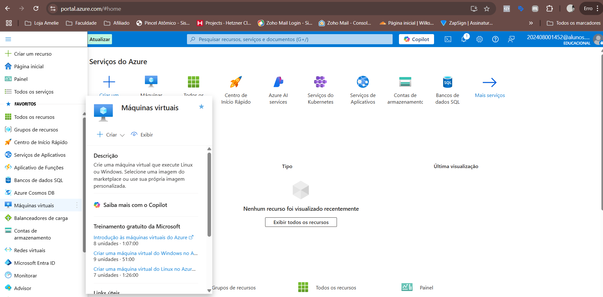
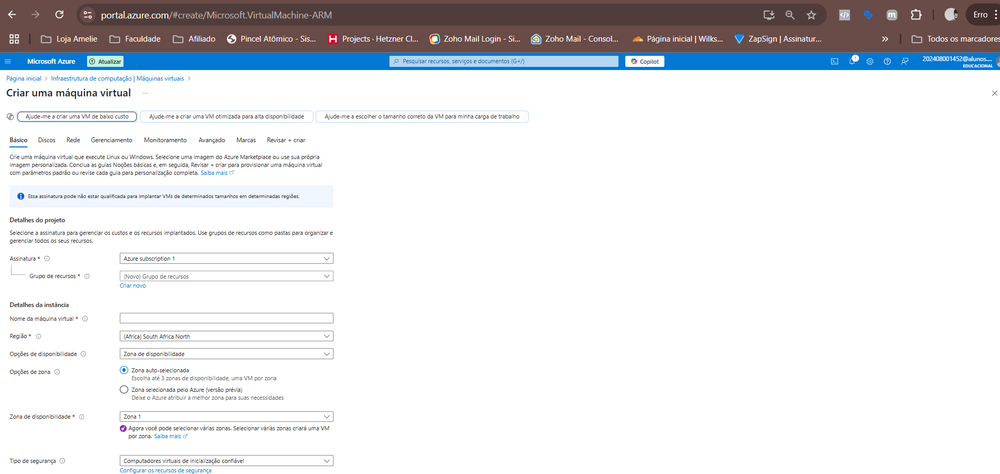

# 💻 Desafio DIO - Criação de Máquina Virtual no Azure

Este repositório documenta minha experiência prática ao criar e configurar uma máquina virtual (VM) no Microsoft Azure. O objetivo foi aplicar os conhecimentos adquiridos sobre computação em nuvem e reforçar boas práticas de documentação técnica.

---

## 📚 Etapas Realizadas

### 1. Acesso ao Portal do Azure
Acesse o [portal do Azure](https://portal.azure.com/) com sua conta Microsoft.

### 2. Criação da Máquina Virtual
- No menu lateral, clique em **Máquinas Virtuais** > **Adicionar** > **Máquina Virtual**.
- Preencha os dados:
  - Grupo de Recursos: `DesafioAzure`
  - Nome da VM: `vm-dio-lab`
  - Imagem: `Windows 10 Pro`
  - Tamanho: `Standard B1s`
  - Nome de usuário e senha para acesso remoto

> 💡 **Dica:** Para contas novas, é possível usar o crédito gratuito do Azure.

### 3. Configuração de Rede
- Habilite a porta **RDP (3389)** para permitir acesso remoto via Área de Trabalho Remota.

### 4. Acesso à Máquina Virtual
- Após a criação, clique em "Conectar" > "RDP"
- Baixe o arquivo `.rdp` e acesse a VM com os dados definidos

---

## 📌 Aprendizados

- Compreendi melhor o modelo **IaaS (Infraestrutura como Serviço)**.
- Pratiquei a criação e configuração de recursos no Azure.
- Fortaleci meu conhecimento em segurança, rede e acesso remoto.
- Usei o GitHub como ferramenta de documentação técnica.

---

## 🛠️ Recursos Complementares

- [Documentação oficial - Criar VM no Azure](https://learn.microsoft.com/pt-br/training/modules/create-windows-virtual-machine-in-azure/)
- [Guia GitHub Markdown](https://guides.github.com/features/mastering-markdown/)

---

## 📸 Imagens

As imagens abaixo ilustram partes importantes do processo:

1. Criação da VM  
   

2. Configurações da VM  
   

3. Acesso remoto via RDP  
   

---

## 🚀 Conclusão

Este desafio me permitiu experimentar, de forma prática, o poder da computação em nuvem com Azure. Me sinto mais preparado para projetos reais envolvendo infraestrutura em nuvem e documentação técnica.
